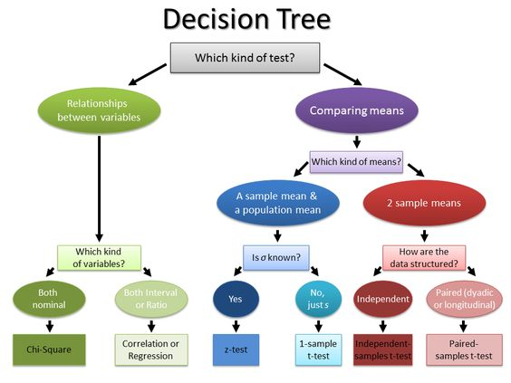
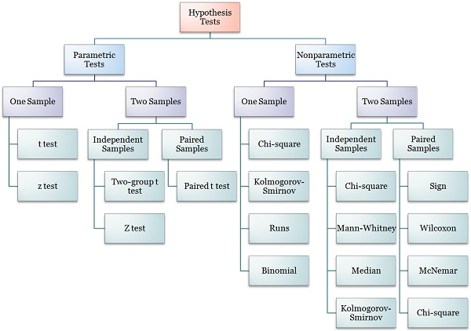

```{r setup, include = FALSE, cache = FALSE, message = FALSE}
## set some knitr options
library(knitr)
library(here)
library(tidyverse)
library(mvnfast)
library(fields)
library(kableExtra)
# ## Figure settings, defaults to png files
opts_chunk$set(fig.align='center', fig.width = 16/4,
               fig.height = 9/4, fig.show = 'hold', par = TRUE,
               dev='png',
               echo = FALSE,
               dpi=72*4, out.width = "80%")

colorize <- function(x, color) {
  if (knitr::is_latex_output()) {
    sprintf("\\textcolor{%s}{%s}", color, x)
  } else if (knitr::is_html_output()) {
    sprintf("<span style='color: %s'>%s</span>", color,
      x)
  } else x
}

hl <- function(x) {
  colorize(x, color = "corals2")
}

set.seed(111)
```

## Data science

* What is data science? 


* Data science is statistics + computer science with a focus on communication


* What is statistics?


* My opinion: data science is what statistics should have been -- the statistics community dropped the ball!


## Statistical Modeling

* Drawing conclusions based on data while accounting for random variation.

<hr style="height:8px; visibility:hidden;" />

* Goal: Make **inference** about the state of the world using **data**.

<hr style="height:8px; visibility:hidden;" />

* Most statistics courses are taught as a recipe. 

    <hr style="height:8px; visibility:hidden;" />

    * If your data are X then do Y.

    <hr style="height:8px; visibility:hidden;" />

    * Where is the creativity? Science?


## What people think statistics is

```{r, out.width="70%", fig.align="center"}

```


## What people think statistics is

```{r, out.width="80%", fig.align="center"}

```


## What statistics actually is

* The creative process of turning data into insights using mathematics

<hr style="height:8px; visibility:hidden;" />

* The mathematics that allow for understanding using data

<hr style="height:8px; visibility:hidden;" />

* Constructive and dynamic

<hr style="height:8px; visibility:hidden;" />

* Collaborative: Opportunity to work with experts in multiple fields

 


## Problem with traditional statistics

* Where is the science?

<hr style="height:8px; visibility:hidden;" />

* Don't we know something about the world other than our data is X?

<hr style="height:8px; visibility:hidden;" />

* How do we add this knowledge into our modeling?

<hr style="height:8px; visibility:hidden;" />


## Scientifically Motivated Statistical Modeling

* Probabilistic modeling.

<hr style="height:8px; visibility:hidden;" />

* Model encodes our understanding of the scientific process of interest.

<hr style="height:8px; visibility:hidden;" />

* Model accounts for as much uncertainty as possible.

<hr style="height:8px; visibility:hidden;" />

* Model results in a probability distribution.

<hr style="height:8px; visibility:hidden;" />

* Update model with data. 

<hr style="height:8px; visibility:hidden;" />

* Use the model to generate parameter estimates given data.

<hr style="height:8px; visibility:hidden;" />


## Scientifically Motivated Statistical Modeling

* Criticize the model

    <hr style="height:6px; visibility:hidden;" />

    * Does the model fit the data well?

    <hr style="height:6px; visibility:hidden;" />

    * Do the predictions make sense?

    <hr style="height:6px; visibility:hidden;" />

    * Are there subsets of the data that don't fit the model well?

    <hr style="height:6px; visibility:hidden;" />    

* Make inference using the model.

<hr style="height:8px; visibility:hidden;" />

* If the model fits the data, use the model fit for prediction or inference.


## Data Science Statistics -- What you will learn

* Focus on the mathematical underpinnings for data science

* Programming languages and data frameworks change
  
    * Today it's python/R 

    * Tomorrow it's (probably) Julia 

* Not everything is big data and most problems don't require deep learning and instead require careful thought


## Data science statistics - What you will learn

* Understanding the first principles ensures your expertise will never become obsolete


    * The models and programming frameworks will change in the future
    
    * The mathematics and statistics underlying these will always be the same


## Data science statistics - What you will learn

* There is a desperate need for people that can think statistically

    * There are many, many more software engineers than data scientists

    * Why?

    * Statistical thinking is hard and takes time to learn


<!-- # Data science statistics -->

<!-- * We hear from our industry partners about the importance of statistical thinking -->

<!-- * Big interest in Bayesian statistical methods -->

<!--     * [Economist presidential forecast](https://projects.economist.com/us-2020-forecast/president) -->
<!--         * [GitHub code](https://github.com/TheEconomist/us-potus-model) -->

<!-- -- -->

<!-- * Why Bayesian? -->

<!--     * constructive -->

<!--     * quantifies uncertainty -->

<!--     * easily customized for the specific problem  -->
        
## Data science statistics 

* Core courses

    * Introduction to Mathematical Statistics
    
    * Statistical forecasting and prediction
    
    * Bayesian Methods
    
* Possible electives 

    * Nonparametric methods

    * Experimental Design
    
    * Analysis of categorical data


## Mathematical Statistics

* Statistical properties
    * What happens to the model inference/prediction as you get more data? 
    * Are the estimates unbiased? 
        * On average, are the estimates equal to the "true" value?
    * Are the estimates consistent?
        * As you get more data, do the estimates converge to the "true" value

* Estimation and testing


## Mathematical Statistics

* Sufficient statistics 

    * The backbone of distributed computing platforms
    
    * Hadoop, Apache Spark, MapReduce, etc.
    

* Decision Theory

    * How to make decisions under uncertainty
    
    * Formal definition of loss and risk
    


## Statistical Forecasting and Prediction

* Modeling of data that is dependent on time
    * Temperature today is more likely to be like yesterday than the same day last year
    * Retail sales today more likely to be like yesterday than last month

* Fundamentals of "time series" data analysis

* Robust understanding of autocorrelation, autoregression, and moving averages

* Fundamental for finance, business forecasting, ecological monitoring, etc.


## Bayesian Methods

* Understanding model building, regularization, classification and prediction.

* Formal modeling of uncertainty 
    * Estimates of how reliable a prediction is

* Inclusion of prior (scientific) knowledge
    * Add knowledge about the real world
    
* Constructive model building
    * Customize the analysis to specific challenges and problems 
    * Not just "data mining"
    * Iterative model building and improvement
    

## Other statistics courses

* Nonparametric statistics
    * What to do when assumptions are not met
    * bootstrapping and resampling methods
    * Foundation for deep learning and ML models

* Experimental statistics
    * A/B testing -- how internet ads are tested
    * Scientific testing

* Analysis of categorical data
    * Generalized linear models
    * Count data
    * Logistic regression
    


## Jobs in Data Science Statistics

* A Data Science Statistics concentration will prepare you for all jobs in data science

* Strongly recommend learning from experts 

    * Much of the work of applied statisticians and data scientists is translating knowledge from experts in a domain area into mathematical models and computer code
    
